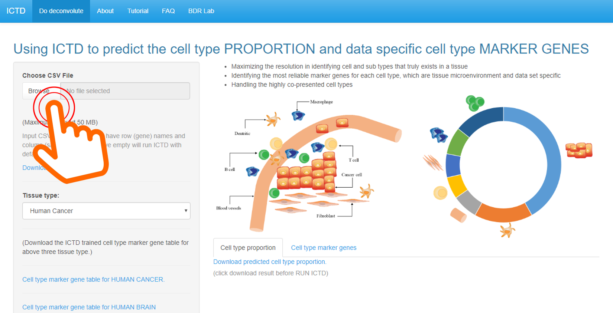
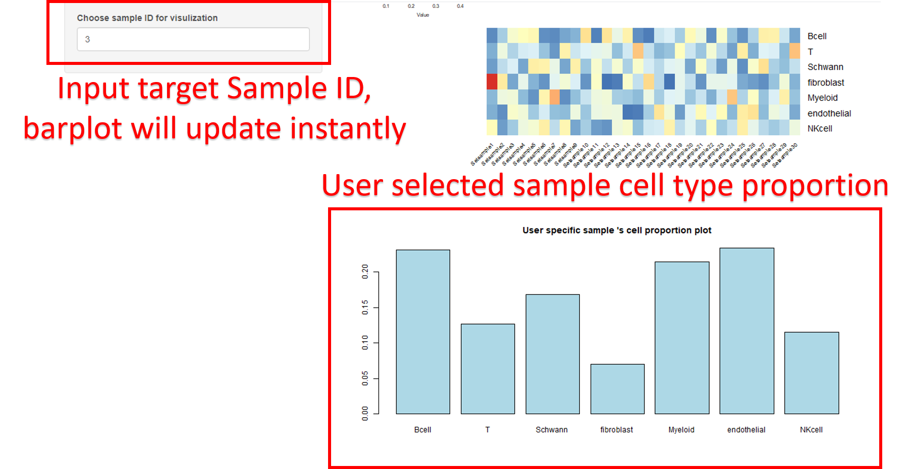

## ICTD Web Application Instruction

- Please **refresh** webpage or click **F5** to make sure R shiny works fine.

1. Upload your data by clicking the **Browse** button. You can skip this step if you wish to use defualt data set. The default dataset can be download follows below instruction. 
 
 
 
2. Choose the **tissue type** for your dataset. 
 
 
 
3. ICTD provied trained cell type marker genes table for above three tissue type.  
You can download the ***score table*** by **clicking** the blue superlink. 
 
 
 
4. It is time to **run ICTD**!  
Clicking the button to active the deconvolution process. The whole process will takes around 5 minutes but the wait time maybe longer if the dataset is large. 
 
 
 
5. The ICTD predicted cell type proportion will show automatically. 
Partial results will print in the form of the table while whole results will show as the heatmap figure. 
 
 
 
6. You can download the predicted result (.csv file) by **clicking** the button. 
 
 
 
7. The ICTD also provided the **top marker genes** of each cell type for the input dataset. 
 
 
 
8. You can download the data specific top marker genes (.csv file) by **clicking** the button. 
 
 
 
9. The web application will plot the cell type proportion (barplot) for **user selected patient**. 
Please **input** your interested patient ID. The barplot will update instantly. 
 
 
 

